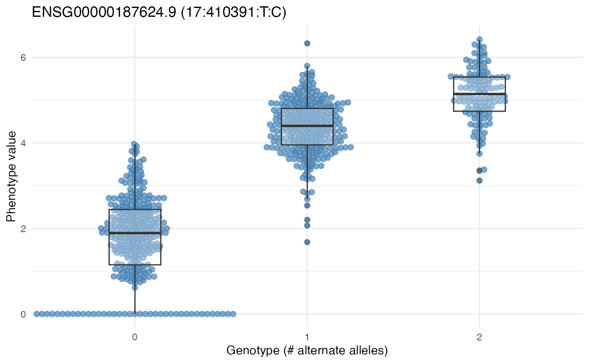

<div id="main" class="col-md-9" role="main">

# eQTL mapping with tQTLExperiment and tensorQTL

<div class="section level2">

## Overview

`tQTLExperiment` wraps the
[tensorQTL](https://github.com/broadinstitute/tensorqtl) GPU-accelerated
eQTL mapping tool in a
[SummarizedExperiment](https://bioconductor.org/packages/SummarizedExperiment)-style
container. The key design principle is a **two-step workflow** that
keeps R and Python in separate environments:

1.  `prepareTQTL()` — writes phenotype and covariate files to a
    directory and returns the complete `python -m tensorqtl` command
    string.
2.  The user runs that command in a terminal with tensorQTL installed.
3.  `readTQTL()` — reads the output files back into R as
    [GRanges](https://bioconductor.org/packages/GenomicRanges).

This avoids all R/Python environment conflicts (conda PATH issues,
`rpy2` segfaults, duplicate OpenMP runtimes).

Genotype data are represented **lazily** via
[BEDMatrix](https://CRAN.R-project.org/package=BEDMatrix) — the PLINK
`.bed` file is never loaded into R memory. This makes it practical to
work with whole-genome genotype files containing millions of variants.

<div class="section level3">

### Installation

<div id="cb1" class="sourceCode">

``` r
if (!requireNamespace("BiocManager", quietly = TRUE))
    install.packages("BiocManager")
BiocManager::install("vjcitn/tQTLExperiment")
```

</div>

tensorQTL must be installed in a Python environment:

<div id="cb2" class="sourceCode">

``` bash
pip install tensorqtl
```

</div>

</div>

</div>

<div class="section level2">

## MAGE example data

This vignette uses data from the
[MAGE](https://www.science.org/doi/10.1126/science.adi6529) study
(Multi-Ancestry Genomics, Epigenomics, and Transcriptomics), a
multi-ancestry eQTL resource. The `CSHLvc2026` companion package
provides cached access to chromosome 17 genotypes and a pre-filtered
pseudobulk B-cell SummarizedExperiment.

<div id="cb3" class="sourceCode">

``` r
library(tQTLExperiment)
#> Warning: package 'BiocGenerics' was built under R version 4.6.1
if (!requireNamespace("CSHLvc2026")) BiocManager::install("vjcitn/CSHLvc2026")
library(CSHLvc2026)

data(mageSEfilt, package = "CSHLvc2026")
mageSEfilt
#> class: RangedSummarizedExperiment 
#> dim: 15116 731 
#> metadata(2): source filt
#> assays(1): pseudocounts
#> rownames(15116): ENSG00000227232.5 ENSG00000233750.3 ...
#>   ENSG00000270726.6 ENSG00000182484.15
#> rowData names(3): shortid symbol gene_biotype
#> colnames(731): HG00096 HG00100 ... NA21129 NA21130
#> colData names(13): SRA_accession internal_libraryID ...
#>   RNAQubitTotalAmount_ng RIN
```

</div>

The genotype data live in PLINK format on OSN cloud storage and are
downloaded once via `BiocFileCache`:

<div id="cb4" class="sourceCode">

``` r
plink_paths <- cache_mage_chr17_plink()
plpre <- tools::file_path_sans_ext(plink_paths[["bed"]])
```

</div>

</div>

<div class="section level2">

## Building a tQTLExperiment

<div class="section level3">

### Covariate matrix

tensorQTL requires numeric covariates. We build a model matrix from
`colData` using `model.matrix()`, then drop the intercept column —
tensorQTL does not expect one. Dropping the first column after
construction (rather than using `~ 0 + ...`) preserves reference-level
dummy coding for factor variables.

<div id="cb5" class="sourceCode">

``` r
cd <- as.data.frame(colData(mageSEfilt))
mm <- model.matrix(~ batch + population + sex, data = cd)
mm <- mm[, -1, drop = FALSE]   # remove (Intercept)
```

</div>

</div>

<div class="section level3">

### Constructor

`tQTLExperimentFromRSE()` takes an existing `RangedSummarizedExperiment`
and PLINK prefix, attaches the lazy genotype matrix, and optionally
records the genome build in `seqinfo`.

<div id="cb6" class="sourceCode">

``` r
tqe <- tQTLExperimentFromRSE(
    se              = mageSEfilt,
    plinkPrefix     = plpre,
    covariateMatrix = mm,
    genome          = "hg38"
)
tqe
```

</div>

</div>

<div class="section level3">

### Adding gene symbols

`addGeneSymbols()` looks up HGNC names via `EnsDb.Hsapiens.v79` and adds
a `gene_name` column to `mcols(rowRanges(tqe))`. Ensembl version
suffixes (e.g. `.3`) are stripped automatically.

<div id="cb7" class="sourceCode">

``` r
tqe <- addGeneSymbols(tqe)
head(mcols(rowRanges(tqe))[, c("phenotype_id", "gene_name")])
```

</div>

</div>

</div>

<div class="section level2">

## Running tensorQTL

<div class="section level3">

### Subset to chr17 features

The PLINK file covers chromosome 17 only, so we filter the SE to
matching features before writing the phenotype file.

<div id="cb8" class="sourceCode">

``` r
is_17 <- as.character(seqnames(rowRanges(tqe))) == "chr17"
tqe17 <- tqe[which(is_17), ]
dim(tqe17)
```

</div>

</div>

<div class="section level3">

### prepareTQTL

`prepareTQTL()` writes `pheno.bed` and `covariates.tsv` to `outDir` and
returns the shell command. The built-in `--maf_threshold` flag is one of
tensorQTL’s key advantages — no pre-filtering step is required.

<div id="cb9" class="sourceCode">

``` r
outdir <- "~/mage_tqtl_run"
dir.create(outdir, showWarnings = FALSE)

cmd <- prepareTQTL(
    tqe17,
    outDir       = outdir,
    mode         = "cis_nominal",
    mafThreshold = 0.05
)
cat(cmd, "\n")
```

</div>

The printed command looks like:

    python3 -m tensorqtl /path/to/CCDG_mage_chr17 ~/mage_tqtl_run/pheno.bed \
        ~/mage_tqtl_run/tqtl_out --mode cis_nominal --maf_threshold 0.05 \
        --window 1000000 -o ~/mage_tqtl_run \
        --covariates ~/mage_tqtl_run/covariates.tsv

Paste this into a terminal where your tensorQTL conda environment is
active:

<div id="cb11" class="sourceCode">

``` bash
conda activate plink-env
KMP_DUPLICATE_LIB_OK=TRUE <paste command>
```

</div>

</div>

<div class="section level3">

### readTQTL

Once tensorQTL finishes, load results back into R. Passing `x = tqe17`
propagates the genome build and gene symbols automatically.

<div id="cb12" class="sourceCode">

``` r
res <- readTQTL(outdir, mode = "cis_nominal", x = tqe17)
res$pairs
```

</div>

</div>

</div>

<div class="section level2">

## Exploring results

<div id="cb13" class="sourceCode">

``` r
pairs <- res$pairs

# top associations by nominal p-value
pairs[order(pairs$pval_nominal)][1:10,
      c("gene_name", "variant_id", "af", "slope", "pval_nominal")]

# associations for a specific gene
tp53bp1 <- pairs[pairs$gene_name == "TP53BP1" & !is.na(pairs$gene_name)]
tp53bp1[order(tp53bp1$pval_nominal)][1:5]

# distribution of nominal p-values
hist(pairs$pval_nominal, breaks = 50,
     main = "tensorQTL nominal p-values (chr17, cis)",
     xlab = "p-value")
```

</div>

</div>

<div class="section level2">

## Demo data

The package includes two datasets for testing and exploration.

<div class="section level3">

### Small example (chr22, 20 genes)

For testing object construction without external dependencies:

<div id="cb14" class="sourceCode">

``` r
exdir <- system.file("extdata", package = "tQTLExperiment")

tqe_ex <- tQTLExperiment(
    plinkPrefix = file.path(exdir, "chr22-n100"),
    phenoFile   = file.path(exdir, "mean-pheno-n100.bed"),
    genome      = "hg38"
)
#> Extracting number of samples and rownames from chr22-n100.fam...
#> Extracting number of variants and colnames from chr22-n100.bim...
tqe_ex
#> class: tQTLExperiment
#> features: 20  samples: 100 
#> assays( 1 ): pheno 
#> rowRanges: GRanges with 20 features
#> colData( 0 ) covariates:   
#> geno: 100 samples x 69638 variants [BEDMatrix - lazy]
#> plinkPrefix: /private/var/folders/yw/gfhgh7k565v9w83x_k764wbc0000gp/T/RtmpTfmPqm/temp_libpathdad43b8ba3a7/tQTLExperiment/extdata/chr22-n100 
#> use prepareTQTL() to write inputs and get CLI command
```

</div>

</div>

<div class="section level3">

### Realistic demo (chr17, 50 genes, pre-computed results)

Pre-computed tensorQTL `cis_nominal` results that demonstrate the full
workflow:

<div id="cb15" class="sourceCode">

``` r
cc = cache_demo_data()
#> [ cache hit   ] covariates.tsv
#> [ cache hit   ] mage_chr17_cis.rda
#> [ cache hit   ] pheno.bed
#> [ cache hit   ] tqtl_out.cis_qtl_pairs.17.parquet
#> [ cache hit   ] tqtl_out.tensorQTL.cis_nominal.log
#> [ complete    ] All demo files cached in: /Users/vincentcarey/Library/Caches/org.R-project.R/R/BiocFileCache/tqtlExperiment_demodir
demodir = dirname(cc$log)

# Load results: 71k+ feature-variant pairs on chr17
res <- readTQTL(demodir, mode = "cis_nominal")
res$pairs |> head()
#> GRanges object with 6 ranges and 10 metadata columns:
#>       seqnames    ranges strand |      phenotype_id    variant_id
#>          <Rle> <IRanges>  <Rle> |       <character>   <character>
#>   [1]       17    114101      * | ENSG00000280279.1 17:114101:G:A
#>   [2]       17    114226      * | ENSG00000280279.1 17:114226:A:G
#>   [3]       17    116159      * | ENSG00000280279.1 17:116159:G:C
#>   [4]       17    116270      * | ENSG00000280279.1 17:116270:G:C
#>   [5]       17    116354      * | ENSG00000280279.1 17:116354:C:T
#>   [6]       17    118358      * | ENSG00000280279.1 17:118358:C:T
#>       start_distance end_distance        af ma_samples  ma_count pval_nominal
#>            <integer>    <integer> <numeric>  <integer> <integer>    <numeric>
#>   [1]          37236        37235 0.4500684        510       658     0.857064
#>   [2]          37361        37360 0.1976744        247       289     0.441229
#>   [3]          39294        39293 0.4507524        515       659     0.883984
#>   [4]          39405        39404 0.2647059        326       387     0.329784
#>   [5]          39489        39488 0.4863201        515       711     0.805759
#>   [6]          41493        41492 0.0978112        136       143     0.516072
#>             slope  slope_se
#>         <numeric> <numeric>
#>   [1] -0.00633339 0.0351502
#>   [2]  0.03399045 0.0441110
#>   [3] -0.00517267 0.0354354
#>   [4]  0.03938431 0.0403842
#>   [5] -0.00807438 0.0328232
#>   [6] -0.04154835 0.0639453
#>   -------
#>   seqinfo: 1 sequence from an unspecified genome; no seqlengths
```

</div>

Top associations by nominal p-value:

<div id="cb16" class="sourceCode">

``` r
top_hits <- res$pairs[order(res$pairs$pval_nominal)][1:10]
top_hits[, c("phenotype_id", "variant_id", "pval_nominal", "slope")]
#> GRanges object with 10 ranges and 4 metadata columns:
#>        seqnames    ranges strand |       phenotype_id             variant_id
#>           <Rle> <IRanges>  <Rle> |        <character>            <character>
#>    [1]       17  35244527      * | ENSG00000166750.10        17:35244527:G:A
#>    [2]       17  76711004      * | ENSG00000182534.14 17:76711004:CGTCGCCG..
#>    [3]       17  50547162      * | ENSG00000006282.21        17:50547162:A:C
#>    [4]       17  76710259      * | ENSG00000182534.14        17:76710259:A:T
#>    [5]       17  76710267      * | ENSG00000182534.14        17:76710267:A:T
#>    [6]       17  76710351      * | ENSG00000182534.14        17:76710351:G:A
#>    [7]       17  76710142      * | ENSG00000182534.14        17:76710142:T:C
#>    [8]       17  76710264      * | ENSG00000182534.14        17:76710264:G:A
#>    [9]       17    410391      * |  ENSG00000187624.9          17:410391:T:C
#>   [10]       17    410351      * |  ENSG00000187624.9          17:410351:G:T
#>        pval_nominal     slope
#>           <numeric> <numeric>
#>    [1] 5.51378e-218  1.728871
#>    [2] 2.62162e-200 -1.964368
#>    [3] 1.88099e-196 -0.931014
#>    [4] 1.55405e-190 -1.937363
#>    [5] 1.55405e-190 -1.937363
#>    [6] 1.55405e-190 -1.937363
#>    [7] 5.61979e-187 -1.925138
#>    [8] 3.13994e-178 -1.881565
#>    [9] 4.92694e-169  1.935477
#>   [10] 6.18071e-169  1.935662
#>   -------
#>   seqinfo: 1 sequence from an unspecified genome; no seqlengths
```

</div>

<div id="cb17" class="sourceCode">

``` r
data(mageSEfilt, package="CSHLvc2026")
plink_paths <- cache_mage_chr17_plink()
#> [ cache hit   ] CCDG_mage_chr17.fam
#> [ cache hit   ] CCDG_mage_chr17.bim
#> [ cache hit   ] CCDG_mage_chr17.bed
#> [ validate    ] Checking .bed magic bytes ...
#> [ validate    ] .bed magic bytes OK.
plpre <- tools::file_path_sans_ext(plink_paths[["bed"]])
cd <- as.data.frame(colData(mageSEfilt))
mm <- model.matrix(~ batch + population + sex, data = cd)
mm <- mm[, -1, drop = FALSE]   # remove (Intercept)
tqe <- tQTLExperimentFromRSE(
    se              = mageSEfilt,
    plinkPrefix     = plpre,
    covariateMatrix = mm,
    genome          = "hg38"
)
#> Extracting number of samples and rownames from CCDG_mage_chr17.fam...
#> Extracting number of variants and colnames from CCDG_mage_chr17.bim...
tqe
#> class: tQTLExperiment
#> features: 15116  samples: 731 
#> assays( 1 ): pseudocounts 
#> rowRanges: GRanges with 15116 features
#> colData( 27 ) covariates: batch, populationASW, populationBEB, populationCDX ... 
#> geno: 731 samples x 2075523 variants [BEDMatrix - lazy]
#> plinkPrefix: /Users/vincentcarey/Library/Caches/org.R-project.R/R/BiocFileCache/CCDG_mage_chr17_plink/CCDG_mage_chr17 
#> use prepareTQTL() to write inputs and get CLI command
plotGenotypeEffect(tqe, "17:410391:T:C", "ENSG00000187624.9")
```

</div>



</div>

</div>

<div class="section level2">

## Session info

<div id="cb18" class="sourceCode">

``` r
sessionInfo()
#> R version 4.6.0 (2026-04-24)
#> Platform: aarch64-apple-darwin23
#> Running under: macOS Sequoia 15.7.7
#> 
#> Matrix products: default
#> BLAS:   /Library/Frameworks/R.framework/Versions/4.6/Resources/lib/libRblas.0.dylib 
#> LAPACK: /Library/Frameworks/R.framework/Versions/4.6/Resources/lib/libRlapack.dylib;  LAPACK version 3.12.1
#> 
#> locale:
#> [1] en_US.UTF-8/en_US.UTF-8/en_US.UTF-8/C/en_US.UTF-8/en_US.UTF-8
#> 
#> time zone: America/New_York
#> tzcode source: internal
#> 
#> attached base packages:
#> [1] stats4    stats     graphics  grDevices utils     datasets  methods  
#> [8] base     
#> 
#> other attached packages:
#>  [1] CSHLvc2026_0.98.8           tQTLExperiment_0.1.29      
#>  [3] arrow_24.0.0                SummarizedExperiment_1.43.0
#>  [5] Biobase_2.73.1              GenomicRanges_1.65.0       
#>  [7] Seqinfo_1.3.0               IRanges_2.47.2             
#>  [9] S4Vectors_0.51.5            BiocGenerics_0.59.8        
#> [11] generics_0.1.4              MatrixGenerics_1.25.0      
#> [13] matrixStats_1.5.0           BiocStyle_2.41.0           
#> 
#> loaded via a namespace (and not attached):
#>  [1] DBI_1.3.0            httr2_1.2.3          rlang_1.2.0         
#>  [4] magrittr_2.0.5       otel_0.2.0           compiler_4.6.0      
#>  [7] RSQLite_3.53.3       png_0.1-9            systemfonts_1.3.2   
#> [10] vctrs_0.7.3          pkgconfig_2.0.3      crayon_1.5.3        
#> [13] fastmap_1.2.0        dbplyr_2.6.0         XVector_0.53.0      
#> [16] labeling_0.4.3       promises_1.5.0       rmarkdown_2.31      
#> [19] UCSC.utils_1.9.0     ggbeeswarm_0.7.3     ragg_1.5.2          
#> [22] purrr_1.2.2          bit_4.6.0            xfun_0.59           
#> [25] cachem_1.1.0         GenomeInfoDb_1.49.1  jsonlite_2.0.0      
#> [28] blob_1.3.0           later_1.4.8          DelayedArray_0.39.3 
#> [31] R6_2.6.1             bslib_0.11.0         RColorBrewer_1.1-3  
#> [34] jquerylib_0.1.4      Rcpp_1.1.1-1.1       bookdown_0.47       
#> [37] assertthat_0.2.1     knitr_1.51           httpuv_1.6.17       
#> [40] Matrix_1.7-5         tidyselect_1.2.1     dichromat_2.0-0.1   
#> [43] abind_1.4-8          yaml_2.3.12          curl_7.1.0          
#> [46] lattice_0.22-9       tibble_3.3.1         withr_3.0.3         
#> [49] shiny_1.14.0         KEGGREST_1.53.4      S7_0.2.2            
#> [52] evaluate_1.0.5       desc_1.4.3           BEDMatrix_2.0.4     
#> [55] BiocFileCache_3.3.0  crochet_2.3.0        Biostrings_2.81.3   
#> [58] pillar_1.11.1        BiocManager_1.30.27  filelock_1.0.3      
#> [61] DT_0.34.0            ggplot2_4.0.3        scales_1.4.0        
#> [64] xtable_1.8-8         glue_1.8.1           tools_4.6.0         
#> [67] data.table_1.18.4    fs_2.1.0             grid_4.6.0          
#> [70] AnnotationDbi_1.75.0 beeswarm_0.4.0       vipor_0.4.7         
#> [73] cli_3.6.6            rappdirs_0.3.4       textshaping_1.0.5   
#> [76] S4Arrays_1.13.0      dplyr_1.2.1          gtable_0.3.6        
#> [79] sass_0.4.10          digest_0.6.39        SparseArray_1.13.2  
#> [82] htmlwidgets_1.6.4    farver_2.1.2         memoise_2.0.1       
#> [85] htmltools_0.5.9      pkgdown_2.2.0        lifecycle_1.0.5     
#> [88] httr_1.4.8           mime_0.13            bit64_4.8.2
```

</div>

</div>

</div>
